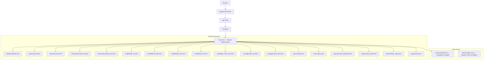

# Design Document: Tailwind UI Overhaul — Kiyabo Duka

## Overview

Complete replacement of the broken Bootstrap-based UI with a professional Tailwind CSS standalone
implementation. The system is a Django 5.x shop management ERP for Upendo Stationery (Dar es Salaam,
TZS currency). Every template currently uses Bootstrap grid/component classes that are not installed,
and crispy-forms tags that are not installed. This overhaul replaces all of that with a dark-sidebar
layout, hand-crafted Tailwind form fields, and accounting-grade report layouts — zero external
dependencies beyond a single downloaded Tailwind CSS file.

## Architecture

### High-Level System Diagram



### Tailwind Standalone Setup

Tailwind CSS standalone CLI produces a single pre-compiled CSS file with all utility classes. No
Node.js, no npm, no build step, no watch process. The file is downloaded once and placed at
`static/css/tailwind.css`. Django serves it via `` like any other static file.

**Download command (run once, not part of dev workflow):**
```bash
# Linux/macOS
curl -sLO https://github.com/tailwindlabs/tailwindcss/releases/latest/download/tailwindcss-linux-x64
chmod +x tailwindcss-linux-x64
./tailwindcss-linux-x64 --input /dev/null --output static/css/tailwind.css --minify

# Windows
# Download tailwindcss-windows-x64.exe from GitHub releases
# tailwindcss-windows-x64.exe --input /dev/null --output static/css/tailwind.css --minify
```

The standalone CLI with `--input /dev/null` generates the full Tailwind CSS preflight + all
utilities (~3.8 MB unminified, ~800 KB minified). This is the correct approach for a Django project
with no JS build pipeline.

**Alternative (CDN for development only):**
```html
<script src="https://cdn.tailwindcss.com"></script>
```
This works for development but should not be used in production.

**Static file configuration (already correct in settings.py):**
```python
STATIC_URL = 'static/'
STATICFILES_DIRS = [BASE_DIR / 'static']
```

The existing `static/css/bootstrap.min.css` and `static/js/bootstrap.bundle.min.js` are deleted
and replaced with `static/css/tailwind.css`.

## Components and Interfaces

### Component 1: base.html — Sidebar Shell

**Purpose:** The single layout shell that all pages extend. Provides the dark sidebar navigation,
top header bar, main content area, flash message rendering, and footer.

**Layout structure:**
```
<body class="bg-gray-100 font-sans">
  <div class="flex h-screen overflow-hidden">
    <!-- Sidebar (fixed, dark) -->
    <aside class="w-64 bg-gray-900 text-white flex-shrink-0 flex flex-col">
      <!-- Brand -->
      <div class="h-16 flex items-center px-6 border-b border-gray-700">
        <span class="text-blue-400 font-bold text-lg">Kiyabo Duka</span>
      </div>
      <!-- Nav groups -->
      <nav class="flex-1 overflow-y-auto py-4 px-3 space-y-1">
        <!-- nav items -->
      </nav>
      <!-- Footer -->
      <div class="p-4 border-t border-gray-700 text-xs text-gray-500">
        Upendo Stationery
      </div>
    </aside>

    <!-- Main area -->
    <div class="flex-1 flex flex-col overflow-hidden">
      <!-- Top bar -->
      <header class="h-16 bg-white border-b border-gray-200 flex items-center px-6 justify-between">
        <!-- Mobile menu toggle + page title + admin link -->
      </header>

      <!-- Scrollable content -->
      <main class="flex-1 overflow-y-auto p-6">
        <!-- Flash messages -->
        
      </main>
    </div>
  </div>
</body>
```

**Template blocks:**
- `` — `<title>` tag content
- `` — page body
- `` — additional `<style>` or `<link>` tags in `<head>`
- `` — scripts before `</body>`

**Sidebar navigation items:**
```
Dashboard        → dashboard:index
─── Transactions ───
Sales            → sales:index
Credit Sales     → credit:index
Inventory        → inventory:index
─── Catalog ───
Products         → catalog:product_list
─── Finance ───
Finance          → finance:index
Assets           → assets:index
─── Reports ───
Reports          → reports:index
─── System ───
Admin            → /admin/
```

Active state detection: `` pattern, same as
current base.html but applied to sidebar link classes instead of top-nav classes.

**Active nav item classes:**
- Active: `bg-blue-600 text-white`
- Inactive: `text-gray-300 hover:bg-gray-800 hover:text-white`

**Mobile behaviour:** Sidebar hidden on `< md` breakpoint. A hamburger button in the top bar
toggles a `translate-x-0` / `-translate-x-full` class via inline JS (no Alpine required).

### Component 2: KPI Card

Used on dashboard and report summary rows.

```html
<div class="bg-white rounded-lg shadow-sm border border-gray-200 p-5">
  <div class="flex items-center gap-4">
    <div class="w-12 h-12 rounded-full bg-green-100 flex items-center justify-center text-green-600 text-xl">
      &#128176;
    </div>
    <div>
      <p class="text-2xl font-bold text-gray-900 tabular-nums">TZS {{ value|floatformat:0 }}</p>
      <p class="text-sm text-gray-500">Label</p>
    </div>
  </div>
</div>
```

### Component 3: Data Table

Standard pattern for all list views.

```html
<div class="bg-white rounded-lg shadow-sm border border-gray-200 overflow-hidden">
  <table class="min-w-full divide-y divide-gray-200 text-sm">
    <thead class="bg-gray-50">
      <tr>
        <th class="px-4 py-3 text-left font-semibold text-gray-600 uppercase tracking-wide text-xs">Col</th>
        <th class="px-4 py-3 text-right font-semibold text-gray-600 uppercase tracking-wide text-xs">Amount</th>
      </tr>
    </thead>
    <tbody class="divide-y divide-gray-100">
      <tr class="hover:bg-gray-50 transition-colors">
        <td class="px-4 py-3 text-gray-900">Value</td>
        <td class="px-4 py-3 text-right tabular-nums font-medium">TZS 0</td>
      </tr>
      <!-- empty state -->
      <tr>
        <td colspan="N" class="px-4 py-8 text-center text-gray-400">No records found</td>
      </tr>
    </tbody>
  </table>
</div>
```

### Component 4: Form Field (Self-Sufficient)

Replaces crispy-forms. Each field rendered manually with consistent Tailwind classes.

```html
<div class="mb-4">
  <label for="{{ field.id_for_label }}" class="block text-sm font-medium text-gray-700 mb-1">
    {{ field.label }} <span class="text-red-500">*</span>
  </label>
  {{ field }}  {# widget rendered by Django, styled via attrs in form Meta #}
  
    
      <p class="mt-1 text-xs text-red-600">{{ error }}</p>
    
  
  
    <p class="mt-1 text-xs text-gray-500">{{ field.help_text }}</p>
  
</div>
```

Widget attrs set in each form's `__init__` or `Meta.widgets`:
```python
# Standard text/number/select input
'class': 'mt-1 block w-full rounded-md border-gray-300 shadow-sm focus:border-blue-500 focus:ring-blue-500 sm:text-sm'

# Textarea
'class': 'mt-1 block w-full rounded-md border-gray-300 shadow-sm focus:border-blue-500 focus:ring-blue-500 sm:text-sm', 'rows': 3
```

### Component 5: Badge / Status Pill

```html
<!-- Success -->
<span class="inline-flex items-center px-2.5 py-0.5 rounded-full text-xs font-medium bg-green-100 text-green-800">OK</span>
<!-- Warning -->
<span class="inline-flex items-center px-2.5 py-0.5 rounded-full text-xs font-medium bg-yellow-100 text-yellow-800">Low Stock</span>
<!-- Danger -->
<span class="inline-flex items-center px-2.5 py-0.5 rounded-full text-xs font-medium bg-red-100 text-red-800">Overdue</span>
<!-- Neutral -->
<span class="inline-flex items-center px-2.5 py-0.5 rounded-full text-xs font-medium bg-gray-100 text-gray-700">Pending</span>
```

### Component 6: Button Variants

```html
<!-- Primary -->
<button class="inline-flex items-center px-4 py-2 bg-blue-600 text-white text-sm font-medium rounded-md hover:bg-blue-700 focus:outline-none focus:ring-2 focus:ring-blue-500 transition-colors">
  Save
</button>
<!-- Secondary / outline -->
<a class="inline-flex items-center px-4 py-2 border border-gray-300 text-gray-700 text-sm font-medium rounded-md hover:bg-gray-50 transition-colors">
  Cancel
</a>
<!-- Accent (green) -->
<button class="inline-flex items-center px-4 py-2 bg-emerald-600 text-white text-sm font-medium rounded-md hover:bg-emerald-700 transition-colors">
  + Credit Sale
</button>
<!-- Small action -->
<a class="px-2.5 py-1 text-xs font-medium bg-blue-50 text-blue-700 rounded hover:bg-blue-100 transition-colors">
  Details
</a>
```

### Component 7: Page Header

```html
<div class="flex items-center justify-between mb-6">
  <h1 class="text-2xl font-bold text-gray-900">Page Title</h1>
  <div class="flex gap-2">
    <!-- action buttons -->
  </div>
</div>
```

### Component 8: Alert / Flash Message

```html
<!-- success -->
<div class="flex items-center gap-3 p-4 mb-4 rounded-lg bg-green-50 border border-green-200 text-green-800 text-sm">
  <span>&#10003;</span> {{ message }}
</div>
<!-- error -->
<div class="flex items-center gap-3 p-4 mb-4 rounded-lg bg-red-50 border border-red-200 text-red-800 text-sm">
  <span>&#10007;</span> {{ message }}
</div>
<!-- warning -->
<div class="flex items-center gap-3 p-4 mb-4 rounded-lg bg-yellow-50 border border-yellow-200 text-yellow-800 text-sm">
  <span>&#9888;</span> {{ message }}
</div>
```

Django message tags map: `success` → green, `error` → red, `warning` → yellow, `info` → blue.

## Page-by-Page Layout Specifications

### Page 1: Dashboard (`dashboard/index.html`)

**Context variables:** `today_revenue`, `today_transactions`, `mtd_revenue`,
`outstanding_receivables`, `overdue_debts`, `low_stock`, `out_of_stock`, `overdue_obligations`,
`recent_sales`, `low_stock_products`

**Layout:**
```
Page Header: "Dashboard" + today's date (right)

Row 1 — 4 KPI cards (grid-cols-1 sm:grid-cols-2 lg:grid-cols-4 gap-4):
  [Today's Revenue]  [Transactions Today]  [Month to Date]  [Outstanding Receivable

## Correctness Properties

*A property is a characteristic or behavior that should hold true across all valid executions of a
system — essentially, a formal statement about what the system should do. Properties serve as the
bridge between human-readable specifications and machine-verifiable correctness guarantees.*

### Property 1: Active navigation state is exclusive

*For any* page rendered by the System, exactly the Sidebar navigation entry whose app matches the
current `request.resolver_match.app_name` SHALL carry the active state classes (`bg-blue-600
text-white`), and all other entries SHALL carry only inactive state classes.

**Validates: Requirement 2.3**

### Property 2: Flash message color mapping is exhaustive

*For any* Django message with a tag value of `success`, `error`, `warning`, or `info`, the
Base_Template SHALL render that message wrapped in the corresponding color class set, and no
message SHALL be rendered without a color class.

**Validates: Requirement 2.4**

### Property 3: No Bootstrap classes in any template

*For any* file in Template_Set, the rendered source SHALL contain zero occurrences of any
Bootstrap_Class pattern (`col-md-`, `d-flex`, `btn btn-`, `table table-`, `badge bg-`, `row g-`,
`container`).

**Validates: Requirements 3.3, 2.5**

### Property 4: All non-PDF templates extend base.html

*For any* template in Template_Set except PDF_Template, the template source SHALL begin with
`` and SHALL contain ``.

**Validates: Requirement 3.2**

### Property 5: Empty-state row present for empty querysets

*For any* list-view template rendered with an empty queryset, the Data_Table SHALL contain a row
with a `colspan` attribute spanning all columns and a non-empty descriptive text string.

**Validates: Requirement 3.6**

### Property 6: Tailwind widget attrs present on all form fields

*For any* form class in Form_Files and *for any* field on that form, the field's widget `attrs`
dictionary SHALL contain the key `class` with a value that includes
`mt-1 block w-full rounded-md border-gray-300`.

**Validates: Requirements 4.2, 4.3, 4.4**

### Property 7: Rendered form inputs carry Tailwind classes

*For any* form from Form_Files rendered by Django's template engine, every `<input>`, `<select>`,
and `<textarea>` element in the rendered HTML SHALL contain the class attribute value
`mt-1 block w-full rounded-md border-gray-300`.

**Validates: Requirement 4.5**

### Property 8: Badge color variants are exhaustive and exclusive

*For any* Badge rendered in Template_Set, the Badge element SHALL carry exactly one of the four
defined color variant class pairs and SHALL NOT carry any Bootstrap badge class.

**Validates: Requirement 5.3**

### Property 9: Button variants are exhaustive and exclusive

*For any* action Button rendered in Template_Set, the Button element SHALL carry exactly one of the
four defined variant class sets and SHALL NOT carry any Bootstrap button class.

**Validates: Requirement 5.4**
